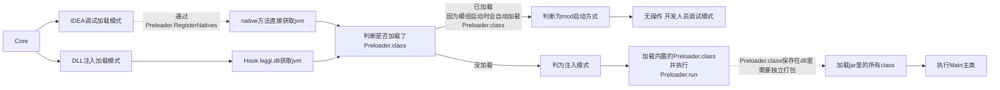

# Test Client
一个完全开源的1.20.1 可注入式客户端Base
## 支持的版本
| Name | Version |
|------|---------|
| Forge | 1.20.1 |
| Fabric | 1.20.1 | 
| Vanilla | 1.20.1 |
### 游戏截图


### 核心Dll https://github.com/FairCauth/Core-Injection.git

## 运行结构



## 构建视频教程
https://b23.tv/sqG10CV

## 快速开始

### 环境要求

开始构建前，请确保已安装：

- Java 17
- Git
- IntelliJ IDEA（推荐）

### 构建项目

在项目根目录运行：

```bat

gradlew.bat buildCompileJars

```

也可以在 IntelliJ IDEA 右侧的 Gradle 面板中运行：

```text

Tasks

└── release

    └── buildCompileJars

```

`buildCompileJars` 会自动构建项目所需的不同版本文件，包括：

- Development

- Forge

- Vanilla

- Fabric

构建完成后，生成的文件会被输出到项目根目录下的：

```text

compile/

```

输出内容通常包括：

```text

compile/

├── *-dev.jar

├── *-forge.jar

├── *-vanilla.jar

├── *-fabric.jar

├── noobf.pack

├── forge.pack

├── vanilla.pack

└── fabric.pack

```

其中：

| 文件 | 用途 |

|---|---|

| `*-dev.jar` | 用于开发环境或未混淆环境 |

| `*-forge.jar` | 用于 Forge 环境 |

| `*-vanilla.jar` | 用于 Vanilla 原版混淆环境 |

| `*-fabric.jar` | 用于 Fabric 环境 |

| `*.pack` | 提供给 Core DLL 加载的打包文件 |

> [!IMPORTANT]

> 请运行 `buildCompileJars`，不要只运行普通的 `build` 或 `jar` 任务。  

> `buildCompileJars` 会自动完成不同运行环境的构建、重映射和打包流程。


# Part1 功能介绍
- 支持 MOD 启动模式与 DLL 注入模式双启动
- 注入基于jvmti无需java agent
- 基于Skia的2D屏幕绘制
- 支持外置Gui
- 内置完全开源的仿Mixin字节码修改框架
- 与`Core.dll`紧密联系 方便操作jni
- Module与Setting Base已全部完善 支持树形设置

# Part2 如何启动？
**▶ 方式一：Forge mod启动
>
>mod启动时默认依赖路径`C:\\Test\\lib`
>
>默认dll名`Core.dll`
>
>将[`ext`](https://github.com/FairCauth/Test-Client/tree/master/ext)内文件复制到依赖路径
>### 如何修改？
>修改 [`Preloader.java`](https://github.com/FairCauth/Test-Client/blob/master/src/main/java/com/fair/preload/Preloader.java) `MAIN_PATH`与`CORE_DLL` 字段

**▶ 方式二：DLL注入启动
>运行`run.vbs`


> [!IMPORTANT]
> 改完`Preloader.java`后 如果要打包注入，请重新打包[`preloader_class.h`](https://github.com/FairCauth/Core-Injection/tree/master/Fair-Core/src/native/preload)

# Part3 其他说明
## 如何获取私有字段？

用 `@Reflect` 注解映射目标类的私有字段，方法声明为 `native`，框架会自动注入实现。

```java
@ClassTransformer(Minecraft.class)
public class MinecraftTransformer implements ITransformer {

    @Reflect("isLocalServer")          // 对应 Minecraft 类中的字段名
    public native static boolean isLocalServer(Minecraft instance);   // getter

    @Reflect("isLocalServer")
    public native static void setLocalServer(Minecraft instance, boolean value); // setter
}
```

**2. 在 [`TransformerLoader`](https://github.com/FairCauth/Test-Client/blob/master/src/main/java/com/test/mod/transformer/TransformerLoader.java) 的构造函数中注册**

```java
public TransformerLoader() {
    add(
            MinecraftTransformer.class,
            GameRendererTransformer.class,
            // ... 
            YourTransformer.class       // ← 在这里添加你的 Transformer
    );
    ...
}
```

## 如何创建树形 Setting？

通过 `SettingAttribute` 可以将 Setting 组织成树形结构，子节点只有在父节点满足条件时才会显示。

### BooleanSetting演示
**结构预览**

```
TreeNode1 (a)
├── TreeNode2-1 (c)
└── TreeNode2-2 (b)
     └── TreeNode3-1 (d)
```

**代码示例**

```java
@SettingInfo(name = {
        @Text(label = "TreeNode3-1", language = Language.English)
})
private final BooleanSetting d = new BooleanSetting(false);

// b 开启时，显示子节点 d
@SettingInfo(name = {
        @Text(label = "TreeNode2-2", language = Language.English)
})
private final BooleanSetting b = new BooleanSetting(false,
        new SettingAttribute<>(d, true)   // d 在 b == true 时显示
);

@SettingInfo(name = {
        @Text(label = "TreeNode2-1", language = Language.English)
})
private final BooleanSetting c = new BooleanSetting(false);

// 根节点，a 开启时显示子节点 b 和 c
@SettingInfo(name = {
        @Text(label = "TreeNode1", language = Language.English)
})
private final BooleanSetting a = new BooleanSetting(false,
        new SettingAttribute<>(b, true),  // b 在 a == true 时显示
        new SettingAttribute<>(c, true)   // c 在 a == true 时显示
);

public TestModule1() {
    registerSetting(a);  // 只需注册根节点，子节点自动递归注册
}
```
### ModeSetting演示
**结构预览**

```
Mode (ModeA / ModeB / ModeC)
├── Setting1 → 仅 ModeA 时显示
├── Setting2 → 仅 ModeB 时显示
└── Setting3 → ModeA / ModeB / ModeC 均显示
```

```java
@SettingInfo(name = { @Text(label = "Setting1", language = Language.English) })
private final BooleanSetting setting1 = new BooleanSetting(false);

@SettingInfo(name = { @Text(label = "Setting2", language = Language.English) })
private final BooleanSetting setting2 = new BooleanSetting(false);

@SettingInfo(name = { @Text(label = "Setting3", language = Language.English) })
private final BooleanSetting setting3 = new BooleanSetting(false);

@SettingInfo(name = { @Text(label = "Mode", language = Language.English) })
private final ModeSetting mode = new ModeSetting(
        "ModeA", 
        Arrays.asList("ModeA", "ModeB", "ModeC"),  
        new SettingAttribute<>(setting1, "ModeA"),            // 仅 ModeA 显示
        new SettingAttribute<>(setting2, "ModeB"),            // 仅 ModeB 显示
        new SettingAttribute<>(setting3, "ModeA", "ModeB", "ModeC")  // 多个选项显示
);

public TestModule1() {
    registerSetting(mode);  // 只需注册根节点，子节点自动递归注册
}
```
