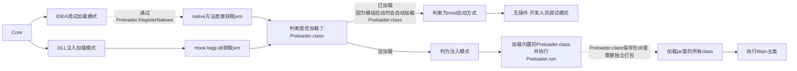

# Test Client
一个完全开源的1.20.1 Forge可注入式客户端Base

### 核心Dll https://github.com/FairCauth/Core-Injection.git

## 运行结构

## 构建视频教程
https://b23.tv/sqG10CV

## STEP1 如何启动？
**▶ 方式一：Forge mod启动
>
>mod启动时默认依赖路径`C:\\Test\\lib`
>
>默认dll名`Core.dll`
>
>将[`ext`](https://github.com/FairCauth/Test-Client/tree/master/ext)内文件复制到依赖路径
>### 如何修改？
>修改 [`Preloader.java`](https://github.com/FairCauth/Test-Client/blob/master/src/main/java/com/fair/preload/Preloader.java) `MAIN_PATH`与`CORE_DLL` 字段

**▶ 方式二：DLL注入启动
>运行`run.vbs`

> [!IMPORTANT]
> 改完`Preloader.java`后 如果要打包注入，请重新打包[`preloader_class.h`](https://github.com/FairCauth/Core-Injection/tree/master/Fair-Core/src/native/preload) 
