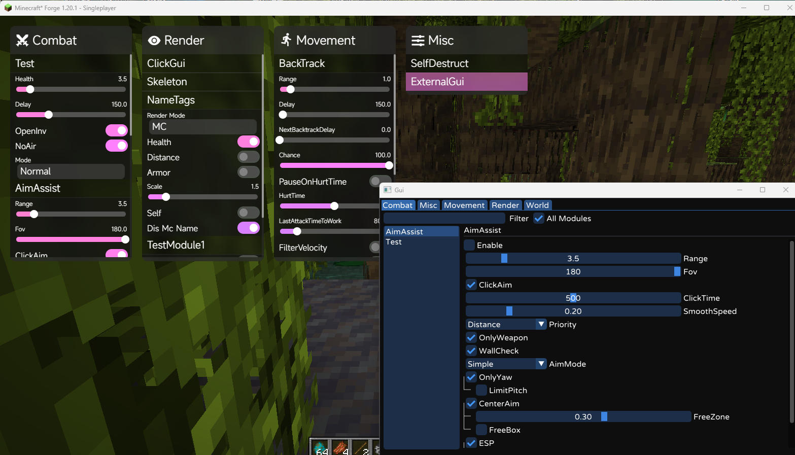
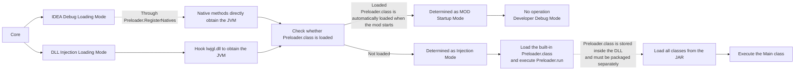

# Test Client
[简体中文](README.md) | [English](README_EN.md)
A fully open-source injectable client base for Minecraft 1.20.1.
## Supported Versions
| Name | Version |
| --- | --- |
| Forge | 1.20.1 |
| Fabric | 1.20.1 |
| Vanilla | 1.20.1 |
### Screenshots

### Core DLL
https://github.com/FairCauth/Core-Injection.git
## Runtime Structure

## Build Video Tutorial
https://b23.tv/sqG10CV
## Quick Start
### Requirements
Before building the project, make sure the following software is installed on Windows:
- Java 17
- Git
- IntelliJ IDEA (recommended)
### Clone the Repository
Open CMD or PowerShell and run:
```bat
git clone https://github.com/FairCauth/Test-Client.git
cd Test-Client
```
Open the project with IntelliJ IDEA and wait for Gradle to finish downloading dependencies and synchronizing the project.
### Build the Project
Run the following command in the project root directory:
```bat
gradlew.bat buildCompileJars
```
You can also run the task from the Gradle panel on the right side of IntelliJ IDEA:
```text
Tasks
└── release
    └── buildCompileJars
```
The `buildCompileJars` task automatically builds the client files required for the following environments:
- Development
- Forge
- Vanilla
- Fabric
After the build is complete, the generated files will be placed in the `compile` directory in the project root:
```text
compile/
├── *-dev.jar
├── *-forge.jar
├── *-vanilla.jar
├── *-fabric.jar
├── noobf.pack
├── forge.pack
├── vanilla.pack
└── fabric.pack
```
| File | Description |
| --- | --- |
| `*-dev.jar` | Used in development or non-obfuscated environments |
| `*-forge.jar` | Used in the Forge environment |
| `*-vanilla.jar` | Used in the obfuscated Vanilla environment |
| `*-fabric.jar` | Used in the Fabric environment |
| `*.pack` | Packaged files loaded by the Core DLL |
> [!IMPORTANT]
> Run `buildCompileJars` instead of only running the standard `build` or `jar` task.
>
> `buildCompileJars` automatically performs the build, remapping, and packaging processes for different runtime environments.
# Part 1: Features
- Supports both MOD startup mode and DLL injection mode
- Injection is based on JVMTI and does not require a Java Agent
- Skia-based 2D screen rendering
- Supports an external GUI
- Includes a fully open-source Mixin-like bytecode transformation framework
- Closely integrated with `Core.dll` for convenient JNI operations
- The Module and Setting base systems are fully implemented
- Supports tree-structured settings
# Part 2: How to Start
**▶ Method 1: Start as a Forge MOD**
> The default dependency path for MOD startup is:
>
> `C:\Test\lib`
>
> The default DLL file name is:
>
> `Core.dll`
>
> Copy the files from the [`ext`](https://github.com/FairCauth/Test-Client/tree/master/ext) directory to the dependency path.
>
> ### How to Modify the Defaults
>
> Open [`Preloader.java`](https://github.com/FairCauth/Test-Client/blob/master/src/main/java/com/fair/preload/Preloader.java) and modify the `MAIN_PATH` and `CORE_DLL` fields.
**▶ Method 2: Start through DLL Injection**
> Run:
>
> `run.vbs`
>
> [!IMPORTANT]
> After modifying `Preloader.java`, if you need to package the project for DLL injection, rebuild [`preloader_class.h`](https://github.com/FairCauth/Core-Injection/tree/master/Fair-Core/src/native/preload).
# Part 3: Additional Information
## How to Access Private Fields
Use the `@Reflect` annotation to map a private field in the target class.
Declare the method as `native`, and the framework will automatically inject its implementation.
```java
@ClassTransformer(Minecraft.class)
public class MinecraftTransformer implements ITransformer {
    @Reflect("isLocalServer") // Field name in the Minecraft class
    public native static boolean isLocalServer(Minecraft instance); // Getter
    @Reflect("isLocalServer")
    public native static void setLocalServer(
            Minecraft instance,
            boolean value
    ); // Setter
}
```
Register the Transformer in the constructor of [`TransformerLoader`](https://github.com/FairCauth/Test-Client/blob/master/src/main/java/com/test/mod/transformer/TransformerLoader.java):
```java
public TransformerLoader() {
    add(
        MinecraftTransformer.class,
        GameRendererTransformer.class,
        // ...
        YourTransformer.class // Add your Transformer here
    );
    ...
}
```
## How to Create Tree-Structured Settings
`SettingAttribute` can be used to organize settings into a tree structure.
A child setting is displayed only when its parent setting meets the specified condition.
### BooleanSetting Example
**Structure Preview**
```text
TreeNode1 (a)
├── TreeNode2-1 (c)
└── TreeNode2-2 (b)
    └── TreeNode3-1 (d)
```
**Code Example**
```java
@SettingInfo(name = {
        @Text(label = "TreeNode3-1", language = Language.English)
})
private final BooleanSetting d = new BooleanSetting(false);
// Display child node d when b is enabled
@SettingInfo(name = {
        @Text(label = "TreeNode2-2", language = Language.English)
})
private final BooleanSetting b = new BooleanSetting(
        false,
        new SettingAttribute<>(d, true) // Display d when b == true
);
@SettingInfo(name = {
        @Text(label = "TreeNode2-1", language = Language.English)
})
private final BooleanSetting c = new BooleanSetting(false);
// Root node: display child nodes b and c when a is enabled
@SettingInfo(name = {
        @Text(label = "TreeNode1", language = Language.English)
})
private final BooleanSetting a = new BooleanSetting(
        false,
        new SettingAttribute<>(b, true), // Display b when a == true
        new SettingAttribute<>(c, true)  // Display c when a == true
);
public TestModule1() {
    registerSetting(a); // Only the root node needs to be registered
}
```
### ModeSetting Example
**Structure Preview**
```text
Mode (ModeA / ModeB / ModeC)
├── Setting1 → Displayed only in ModeA
├── Setting2 → Displayed only in ModeB
└── Setting3 → Displayed in ModeA, ModeB, and ModeC
```
**Code Example**
```java
@SettingInfo(name = {
        @Text(label = "Setting1", language = Language.English)
})
private final BooleanSetting setting1 = new BooleanSetting(false);
@SettingInfo(name = {
        @Text(label = "Setting2", language = Language.English)
})
private final BooleanSetting setting2 = new BooleanSetting(false);
@SettingInfo(name = {
        @Text(label = "Setting3", language = Language.English)
})
private final BooleanSetting setting3 = new BooleanSetting(false);
@SettingInfo(name = {
        @Text(label = "Mode", language = Language.English)
})
private final ModeSetting mode = new ModeSetting(
        "ModeA",
        Arrays.asList(
                "ModeA",
                "ModeB",
                "ModeC"
        ),
        new SettingAttribute<>(setting1, "ModeA"), // Displayed only in ModeA
        new SettingAttribute<>(setting2, "ModeB"), // Displayed only in ModeB
        new SettingAttribute<>(
                setting3,
                "ModeA",
                "ModeB",
                "ModeC"
        ) // Displayed in multiple modes
);
public TestModule1() {
    registerSetting(mode); // Only the root node needs to be registered
}
```
